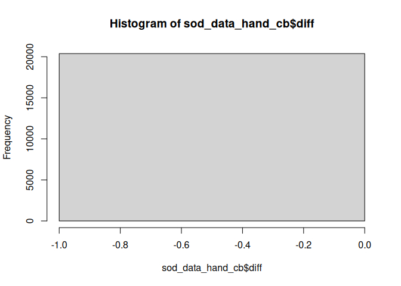
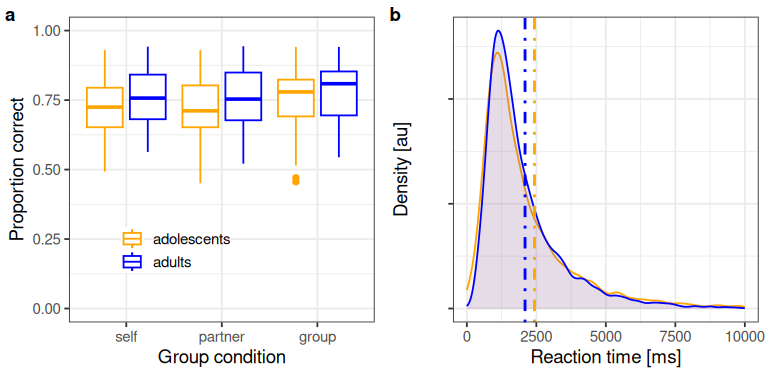
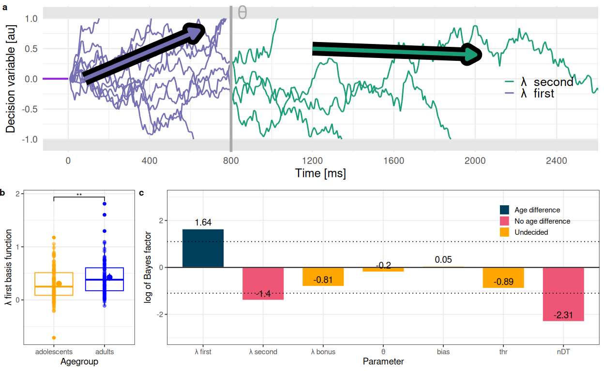

Development of Social Basis Functions
================

- [Data preparation](#data-preparation)
- [Sanity checks](#sanity-checks)
- [Performance and reaction time](#performance-and-reaction-time)
- [Group differences in performance?](#group-differences-in-performance)
- [Group differences in response
  time?](#group-differences-in-response-time)
- [Prepare data for regressions](#prepare-data-for-regressions)
- [Look at individual slopes](#look-at-individual-slopes)
- [Compute inference statistics](#compute-inference-statistics)
- [Classic Welch t-test](#classic-welch-t-test)
- [Figures](#figures)
  - [Percent correct and reaction time
    figure](#percent-correct-and-reaction-time-figure)
- [Age Effect of irrelevant weights on population
  level](#age-effect-of-irrelevant-weights-on-population-level)
- [DDM](#ddm)
- [Compute group differences stats for ddm
  parameters](#compute-group-differences-stats-for-ddm-parameters)
- [Show Bayes Factors](#show-bayes-factors)
- [Compare to time varying to vanilla
  ddm](#compare-to-time-varying-to-vanilla-ddm)

# Data preparation

I add a flag to indicate whether we are looking at adoelscents, or
adults and recode O1 and O2 to indicate relevant and irrelevant
opponents, which is different in differnt trials. I also summarise the
decison type variable into partner and self trials. I did not z-score
the performances.

``` r
#self: 1, partner:2, group:3
sod_data<-read_csv(here::here("data","sod_data.csv"))%>%filter(!is.na(version))%>%
  mutate(group=ifelse(age>=18,"adults","adolescents")) %>% filter(trial>4)%>%
  rowwise()%>%
  mutate(self_partner=case_when(
    (decision_type==1 | decision_type == 2)~"self", # 1 and 2 are self trials
    (decision_type==3 | decision_type == 4)~"partner", # 2 and 3 are partner trials
    decision_type==5 ~ "group" #. 5 are group trials
  ))%>%
  mutate(Or=case_when(
    (decision_type==1 | decision_type == 3)~O1, #i.e., 'S vs. O1' or  'P vs. O1', makes O1, relevant opponent
    (decision_type==2 | decision_type == 4)~O2, # i.e., 'P vs.O2' or 'P vs. 02' makes O2 the relevant opponent
    decision_type==5 ~ O1# here it does not matter
  ),
  Oi=case_when(
    (decision_type==1 | decision_type == 3)~O2, #i.e., 'S vs. O1' or  'P vs. O1', makes O2, irrelevant opponent
    (decision_type==2 | decision_type == 4)~O1, # i.e., 'P vs.O2' or 'P vs. 02' makes O1 the irrelevant opponent
    decision_type==5 ~ O2# does not matter
  )
  )%>%select(-S_perf,-P_perf,-O1_perf,-O2_perf)%>%
  mutate(#make factors
    group=factor(group),
    self_partner=factor(self_partner)
  )
```

# Sanity checks

compute bonus by hand again there should be no difference between out
eng and this bonus and out eng should be roughly normally distributed.

``` r
sod_data_hand_cb<-sod_data%>%rowwise()%>%mutate(
  bonus_comp=case_when(
    decision_type == 1 ~ S - O1 + bonus,
    decision_type == 2 ~ S - O2 + bonus, # 1 and 2 are self trials
    decision_type == 3 ~ P - O1 + bonus, # 2 and 3 are partner trials
    decision_type == 4 ~ P - O2 + bonus,
    decision_type == 5 ~ (S+P) - (O1 + O2)  + bonus#. 5 are group trials
  )
)%>%mutate(diff=bonus_comp-out_eng)

# these are sanity checks....
hist(sod_data_hand_cb$diff)
```

<!-- -->

``` r
hist(sod_data_hand_cb$out_eng)# should 
```

<!-- -->

``` r
means_medians<-sod_data%>%group_by(group)%>%
  dplyr::summarise(m_rt=mean(rt),
                   med_rt=median(rt))
```

# Performance and reaction time

Here we regress correct choices on prticipants age groups and whether we
asked for self, partner or group decisions. We also regress rts

``` r
sod_data$self_partner=factor(sod_data$self_partner,levels=c("self","partner","group"),ordered=F)

perf_mod<-sod_data%>%
  brm(correct ~ group*self_partner,
      data=.,
      prior=priors_bf,
      family=bernoulli(link='logit'),
      cores=4,
      file_refit = "on_change",
      file=here::here("derivatives","performance_model.rds")
  )


# reaction times
rt_mod<-sod_data%>%
  brms::brm(
    rt~group,
    family=shifted_lognormal(),
    data=.,cores=4,
    sample_prior = T,
    prior=priors_bf,
    file_refit = "on_change",
    file=here::here("derivatives","rt_model.rds"),
  )

rt_mod_prior<-sod_data%>%
  brms::brm(
    rt~group,
    family=shifted_lognormal(),
    data=.,cores=4,
    sample_prior = "only",
    prior=priors_bf,
    file_refit = "on_change",
    file=here::here("derivatives","prior_rt_model.rds")
  )

perf_mod_prior<-sod_data%>%
  brm(correct ~ group*self_partner,
      data=.,
      prior=priors_bf,
      family=bernoulli(link='logit'),
      sample_prior = "only",
      file_refit = "on_change",
      cores=4,
      file=here::here("derivatives","prior_performance_model.rds")
  )
```

# Group differences in performance?

``` r
bayesfactor_parameters(perf_mod,prior=perf_mod_prior)
```

    ## Warning: Bayes factors might not be precise.
    ##   For precise Bayes factors, sampling at least 40,000 posterior samples is
    ##   recommended.

    ## Bayes Factor (Savage-Dickey density ratio)
    ## 
    ## Parameter            |        BF
    ## --------------------------------
    ## (Intercept)          | 2.15e+110
    ## group1               |  2.48e+04
    ## self_partner1        |    424.48
    ## self_partner2        |      1.27
    ## group1:self_partner1 |     0.569
    ## group1:self_partner2 |     0.367
    ## 
    ## * Evidence Against The Null: 0

``` r
describe_posterior(perf_mod)
```

    ## Summary of Posterior Distribution
    ## 
    ## Parameter            | Median |        95% CI |     pd |          ROPE
    ## ----------------------------------------------------------------------
    ## (Intercept)          |   1.09 | [ 1.06, 1.13] |   100% | [-0.18, 0.18]
    ## group1               |   0.18 | [ 0.12, 0.25] |   100% | [-0.18, 0.18]
    ## self_partner1        |   0.17 | [ 0.10, 0.25] |   100% | [-0.18, 0.18]
    ## self_partner2        |  -0.07 | [-0.15, 0.00] | 97.22% | [-0.18, 0.18]
    ## group1:self_partner1 |  -0.07 | [-0.22, 0.07] | 82.58% | [-0.18, 0.18]
    ## group1:self_partner2 |  -0.02 | [-0.17, 0.12] | 62.32% | [-0.18, 0.18]
    ## 
    ## Parameter            | % in ROPE |  Rhat |     ESS
    ## --------------------------------------------------
    ## (Intercept)          |        0% | 1.000 | 5916.00
    ## group1               |    46.82% | 1.000 | 4407.00
    ## self_partner1        |    61.32% | 1.000 | 5166.00
    ## self_partner2        |      100% | 0.999 | 5037.00
    ## group1:self_partner1 |    95.61% | 1.000 | 5359.00
    ## group1:self_partner2 |      100% | 1.000 | 5037.00

# Group differences in response time?

``` r
bayesfactor_parameters(rt_mod,prior=rt_mod_prior)
```

    ## Warning: Bayes factors might not be precise.
    ##   For precise Bayes factors, sampling at least 40,000 posterior samples is
    ##   recommended.

    ## Bayes Factor (Savage-Dickey density ratio)
    ## 
    ## Parameter   |    BF
    ## -------------------
    ## (Intercept) |   Inf
    ## group1      | 0.144
    ## 
    ## * Evidence Against The Null: 0

``` r
describe_posterior(rt_mod)
```

    ## Summary of Posterior Distribution
    ## 
    ## Parameter   | Median |        95% CI |     pd |              ROPE | % in ROPE
    ## -----------------------------------------------------------------------------
    ## (Intercept) |   7.42 | [ 7.40, 7.43] |   100% | [-304.87, 304.87] |      100%
    ## group1      |   0.01 | [-0.01, 0.04] | 90.95% | [-304.87, 304.87] |      100%
    ## 
    ## Parameter   |  Rhat |     ESS
    ## -----------------------------
    ## (Intercept) | 1.001 | 4341.00
    ## group1      | 1.001 | 4254.00

# Prepare data for regressions

Computes DSrel und DSirr.

``` r
reg_dat<-sod_data%>%filter(self_partner!="group")%>%rowwise()%>%
  mutate(
    relevant=case_when(self_partner=="self" ~ (S-Or)+bonus,
                       self_partner=="partner" ~ (P-Or)+bonus
    ),
    irrelevant=case_when(self_partner=="self" ~ P-Oi,
                         self_partner=="partner" ~ S-Oi
    )
  )%>% mutate(
    relevant=(relevant-mean(relevant))/sd(relevant)*0.5,
    irrelevant=(irrelevant-mean(irrelevant))/sd(irrelevant)*0.5
  )%>%
  mutate(Pr=ifelse(self_partner=="self",S,P))%>%
  mutate(Pi=ifelse(self_partner=="self",P,S))
```

# Look at individual slopes

Here, i am computing a logistic regression that predicts “engage
decisions”, decisions in which participants said that they or their
group performed better than the others. We include Difference scores for
of self partner relevant and irrelevant other and the bonus. We compute
separate regressions for trial types (self, partner) and each
participant.

I use a ridge regression for every participant, where i compute a
regularization parameter, $\lambda$, for the population, which is
applied to the first level regressions.

``` r
set.seed(1234)

# infer regularization parameter using cross validation
f<-model.matrix(response_n~relevant*irrelevant,data = reg_dat,family="binomial")
u<-reg_dat$response_n
lambda=cv.glmnet(f, u,family="binomial")
l_for_all=lambda$lambda.1se

# function that is fitting ridge regression
ridge_r<-function(dat,lambda){
  dat<-dat%>%filter(self_partner!="group")
  x<-model.matrix(response_n~relevant*irrelevant,data = dat,family="binomial")
  y<-dat$response_n
  mod<-glmnet(x,y,family = "binomial",lambda = lambda)
  tidy(mod)
}

ridge_fitted_weights<-reg_dat%>%filter(self_partner!="group")%>%
  group_by(subject_id,group,self_partner,sex,age)%>%
  do(
    ridge_r(dat=.,lambda=l_for_all)
  )
```

``` r
# frequentist.
ridge_fitted_weights%>%
  filter(term %in% c("irrelevant","relevant"))%>%
  lm(estimate~group*term,data=.)%>%anova()

# post hoc
ridge_fitted_weights%>%
  filter(term %in% c("irrelevant"))%>%
  lm(estimate~group,data=.)%>%anova()


# Bayesian regression
modbrm<-ridge_fitted_weights%>%
  filter(term %in% c("irrelevant","relevant"))%>%
  brm(
    estimate~group*term,
    data=.,
    prior = priors_bf,
    sample_prior = T,
    chains=4,iter=100000,seed = 1234,threads = threading(static = T),
    file = here::here("derivatives","weights_age_interaction.rds"),
    file_refit = "on_change"
  )


# "post hoc t-test; direct comparison"
modbrm_group<-ridge_fitted_weights%>%
  filter(term %in% c("irrelevant"))%>%
  brm(
    estimate~group,
    data=.,
    prior = priors_bf,
    sample_prior = T,
    chains=4,iter=100000,seed = 1234,threads = threading(static = T),
    file = here::here("derivatives","irr_weights_age.rds"),
    file_refit = "on_change"
  )

## Priors for Bayes factors
modbrm_priors<-ridge_fitted_weights%>%
  filter(term %in% c("irrelevant","relevant"))%>%
  brm(
    estimate~group*term,
    data=.,
    prior = priors_bf,
    sample_prior = "only",
    chains=4,iter=100000,seed = 1234,threads = threading(static = T),
    file = here::here("derivatives","priors_weights_age_interaction.rds"),
    file_refit = "on_change"
  )

modbrm_group_priors<-ridge_fitted_weights%>%
  filter(term %in% c("irrelevant"))%>%
  brm(
    estimate~group,
    data=.,
    prior = priors_bf,
    sample_prior = "only",
    chains=4,iter=100000,seed = 1234,threads = threading(static = T),
    file = here::here("derivatives","prior_irr_weights_age.rds"),
    file_refit = "on_change"
  )
```

# Compute inference statistics

Here, we calculate the Bayes factor when comparing irrelevant weights
between age groups.

### Regression with interaction term.

``` r
BF_whole<-bayesfactor_parameters(modbrm,prior=modbrm_priors)
posterior_whole<-describe_posterior(modbrm)

posterior_whole
```

    ## Summary of Posterior Distribution
    ## 
    ## Parameter    | Median |        95% CI |     pd |          ROPE | % in ROPE
    ## --------------------------------------------------------------------------
    ## (Intercept)  |   1.75 | [ 1.60, 1.91] |   100% | [-0.19, 0.19] |        0%
    ## group1       |   0.27 | [ 0.03, 0.51] | 98.59% | [-0.19, 0.19] |    23.68%
    ## term1        |   1.64 | [ 1.37, 1.89] |   100% | [-0.19, 0.19] |        0%
    ## group1:term1 |   0.04 | [-0.29, 0.37] | 59.77% | [-0.19, 0.19] |    75.38%
    ## 
    ## Parameter    |  Rhat |      ESS
    ## -------------------------------
    ## (Intercept)  | 1.000 | 2.36e+05
    ## group1       | 1.000 | 2.37e+05
    ## term1        | 1.000 | 2.22e+05
    ## group1:term1 | 1.000 | 2.38e+05

``` r
BF_whole
```

    ## Bayes Factor (Savage-Dickey density ratio)
    ## 
    ## Parameter    |       BF
    ## -----------------------
    ## (Intercept)  | 3.88e+28
    ## group1       |     6.74
    ## term1        | 1.65e+15
    ## group1:term1 |    0.862
    ## 
    ## * Evidence Against The Null: 0

### Regression t-test equivavlent for irrelvant weights.

``` r
BF_group<-bayestestR::bayesfactor_parameters(modbrm_group,prior=modbrm_group_priors)
posterior_group<-describe_posterior(modbrm_group)

posterior_group
```

    ## Summary of Posterior Distribution
    ## 
    ## Parameter   | Median |       95% CI |     pd |          ROPE | % in ROPE
    ## ------------------------------------------------------------------------
    ## (Intercept) |   0.39 | [0.28, 0.50] |   100% | [-0.07, 0.07] |        0%
    ## group1      |   0.20 | [0.01, 0.39] | 97.99% | [-0.07, 0.07] |     6.23%
    ## 
    ## Parameter   |  Rhat |      ESS
    ## ------------------------------
    ## (Intercept) | 1.000 | 2.25e+05
    ## group1      | 1.000 | 2.21e+05

``` r
BF_group
```

    ## Bayes Factor (Savage-Dickey density ratio)
    ## 
    ## Parameter   |       BF
    ## ----------------------
    ## (Intercept) | 1.77e+06
    ## group1      |     3.98
    ## 
    ## * Evidence Against The Null: 0

# Classic Welch t-test

``` r
# freq t test
t.test(
  ridge_fitted_weights%>%
    filter(term == "irrelevant" & group == "adolescents")%>%pull(estimate),
  ridge_fitted_weights%>%
    filter(term == "irrelevant" & group == "adults")%>%pull(estimate)
)
```

    ## 
    ##  Welch Two Sample t-test
    ## 
    ## data:  ridge_fitted_weights %>% filter(term == "irrelevant" & group == "adolescents") %>% pull(estimate) and ridge_fitted_weights %>% filter(term == "irrelevant" & group == "adults") %>% pull(estimate)
    ## t = -2.3755, df = 136.54, p-value = 0.01891
    ## alternative hypothesis: true difference in means is not equal to 0
    ## 95 percent confidence interval:
    ##  -0.47948056 -0.04384049
    ## sample estimates:
    ## mean of x mean of y 
    ## 0.2602671 0.5219276

# Figures

## Percent correct and reaction time figure

``` r
sod_data$self_partner=factor(sod_data$self_partner,levels=c("self","partner","group"),ordered=T)
perfs<-sod_data%>%ungroup()%>%
  group_by(subject_id,self_partner,group)%>%
  dplyr::summarise(correct=mean(correct))%>%
  ggplot(aes(x=self_partner,y=correct,color=as.factor(group),group=interaction(group,self_partner)))+
  stat_summary(position=position_dodge(0.9),fun.data = "mean_cl_boot")+
  geom_boxplot(position = position_dodge(0.9))+
  coord_cartesian(ylim=c(0,1))+
  scale_x_discrete(name="Group condition")+
  scale_color_manual(name="",breaks=c("adolescents","adults"),values=c("orange","blue"))+
  scale_y_continuous(name="Proportion correct")+
  theme_bw(14)+
  theme(aspect.ratio=1,
        legend.position = c(0.35,0.28),
        legend.background = element_blank())

rts<-sod_data%>%filter(rt<10000)%>%
  ggplot(aes(x=rt,color=as.factor(group),group=group))+
  geom_density(aes(fill=group),alpha=0.1)+#,position = "dodge")+
  scale_x_continuous(name="Reaction time [ms]")+
  scale_y_continuous(name="Density [au]",labels = scales::number_format(accuracy = 0.01))+
  geom_vline(aes(xintercept=means_medians[means_medians$group=="adolescents",]$m_rt),color="orange",linetype="dotdash",size=1)+
  #  geom_vline(aes(xintercept=means_medians[means_medians$group=="adolescents",]$med_rt),color="orange",linetype="dashed",size=1)+
  geom_vline(aes(xintercept=means_medians[means_medians$group=="adults",]$m_rt),color="blue",linetype="dotdash",size=1)+
  #geom_vline(aes(xintercept=means_medians[means_medians$group=="adults",]$med_rt),color="blue",linetype="dashed",size=1)+
  scale_color_manual(name="",breaks=c("adolescents","adults"),values=c("orange","blue"))+
  scale_fill_manual(name="",breaks=c("adolescents","adults"),values=c("orange","blue"))+
  theme_bw(14)+
  theme(aspect.ratio=1,
        legend.position = "none",
        legend.background = element_blank(),
        axis.text.y = element_text(color="white"))
```

    ## Warning: Using `size` aesthetic for lines was deprecated in ggplot2 3.4.0.
    ## ℹ Please use `linewidth` instead.
    ## This warning is displayed once every 8 hours.
    ## Call `lifecycle::last_lifecycle_warnings()` to see where this warning was
    ## generated.

``` r
perf_rt_plot<-cowplot::plot_grid(perfs,rts,labels="auto")
perf_rt_plot
```

<!-- -->

``` r
ggsave(perf_rt_plot,filename="perf_plot.jpg",width=8,height=4,dpi=600)
```

# Age Effect of irrelevant weights on population level

#### Figure 4a

``` r
# This here is a ridge regression function, analogously to the above one to visualize the individual player weights,
# For power reasons they have been summarised above.

ridge_r_viz<-function(dat,lambda){
  # print("huh")
  dat<-dat%>%filter(self_partner!="group")
  x<-model.matrix(response_n~S+P+Or+Oi+bonus,data = dat,family="binomial")
  y<-dat$response_n
  #l=cv.glmnet(x, y,family="binomial")$lambda.min
  mod<-glmnet(x,y,family = "binomial",lambda = lambda)
  tidy(mod)
}


ridge_fitted_weights_viz<-reg_dat%>%filter(self_partner!="group")%>%
  group_by(subject_id,group,self_partner,sex,age)%>%
  do(
    ridge_r_viz(dat=.,lambda=l_for_all)
  )

## This makes the average bar graphs
p_ppt_lvl_slopes<-ridge_fitted_weights_viz%>%
  mutate(group=ifelse(age>18,"adults","adolescents"))%>%rowwise()%>%
  filter(term %in% c("S","P","Oi","Or"))%>%
  mutate(rel_irel=case_when(
    self_partner=="partner" & term %in% c("S")~"Pi",
    self_partner=="self" & term %in% c("P")~"Pi",
    self_partner=="partner" & term %in% c("P")~"Pr",
    self_partner=="self" & term %in% c("S")~"Pr",
    term %in% c("Oi","Or")~term
  ))%>%filter(!is.na(rel_irel))%>%
  mutate(rel_irel=factor(rel_irel,levels = c("Pr","Pi","Or","Oi"),labels=c("Ir","Ii","Or","Oi")))%>%
  ggplot(aes(x=rel_irel,y=estimate,color=group))+
  stat_summary(position=position_dodge(1),fun.data = "mean_se",geom="bar",fill="grey")+
  stat_summary(position=position_dodge(1),fun.data = "mean_cl_boot")+
  scale_y_continuous(name="Decision weight")+
  scale_x_discrete(name="Player")+
  scale_color_manual(name="",breaks=c("adolescents","adults"),values=c("orange","blue"))+
  geom_hline(aes(yintercept=0))+
  guides(color=F)+
  theme_bw(14)+
  theme(aspect.ratio = 1)
```

    ## Warning: The `<scale>` argument of `guides()` cannot be `FALSE`. Use "none" instead as
    ## of ggplot2 3.3.4.
    ## This warning is displayed once every 8 hours.
    ## Call `lifecycle::last_lifecycle_warnings()` to see where this warning was
    ## generated.

``` r
## The little inset figure 
p_ppt_lvl_slopes_inset<-ridge_fitted_weights_viz%>%
  mutate(group=ifelse(age>18,"adults","adolescents"))%>%rowwise()%>%
  filter(term %in% c("S","P","Oi","Or"))%>%
  mutate(rel_irel=case_when(
    self_partner=="partner" & term %in% c("S")~"Pi",
    self_partner=="self" & term %in% c("P")~"Pi",
    self_partner=="partner" & term %in% c("P")~"Pr",
    self_partner=="self" & term %in% c("S")~"Pr",
    term %in% c("Oi","Or")~term
  ))%>%filter(!is.na(rel_irel))%>%
  mutate(rel_irel=factor(rel_irel,levels = c("Pr","Pi","Or","Oi"),labels=c("Ir","Ii","Or","Oi")))%>%
  ggplot(aes(x=rel_irel,y=estimate,color=group))+#group=interaction(group,rel_irel)))+
  geom_dotplot(binaxis = "y", stackdir = "center",dotsize=0.5,position = "dodge",binwidth=0.1)+
  scale_y_continuous(name="Decision weight")+
  scale_x_discrete(name="Player")+
  scale_color_manual(name="",breaks=c("adolescents","adults"),values=c("orange","blue"))+
  # stat_summary()+
  geom_hline(aes(yintercept=0))+
  guides(color=F)+
  # facet_grid(.~ self_partner)+#,labeller = labeller(self_partner=labels))+
  coord_cartesian(ylim=c(-3,3))+
  theme_bw(9)+
  theme(aspect.ratio = 1)

# needed for inset
library(grid)
# Convert the inset plot to a grob
inset_grob <- ggplotGrob(p_ppt_lvl_slopes_inset)
# Add the inset to the main plot
p_ppt_lvl_slopes_withinset <- p_ppt_lvl_slopes +
  annotation_custom(
    grob = inset_grob,
    xmin = 2.5, xmax = 4.5,  # Adjust these values to position the inset
    ymin = 0.07, ymax = 1
  )
```

### Panel 4b

``` r
#This regression just for visualization. A full random slopes model does not converge. We need ridge regression.
glm(response_n ~ relevant*irrelevant*group,data=reg_dat,family = binomial(link=logit))%>%anova()
```

    ## Analysis of Deviance Table
    ## 
    ## Model: binomial, link: logit
    ## 
    ## Response: response_n
    ## 
    ## Terms added sequentially (first to last)
    ## 
    ## 
    ##                           Df Deviance Resid. Df Resid. Dev  Pr(>Chi)    
    ## NULL                                      13719      18934              
    ## relevant                   1   3679.0     13718      15256 < 2.2e-16 ***
    ## irrelevant                 1     91.5     13717      15164 < 2.2e-16 ***
    ## group                      1      1.5     13716      15163  0.221211    
    ## relevant:irrelevant        1      6.7     13715      15156  0.009639 ** 
    ## relevant:group             1     26.3     13714      15130 2.895e-07 ***
    ## irrelevant:group           1      5.9     13713      15124  0.015033 *  
    ## relevant:irrelevant:group  1      1.5     13712      15122  0.214335    
    ## ---
    ## Signif. codes:  0 '***' 0.001 '**' 0.01 '*' 0.05 '.' 0.1 ' ' 1

``` r
mod_populationlevel<-glm(response_n ~ relevant*irrelevant*group,data=reg_dat,family = binomial(link=logit))

ina_plots<-sjPlot::plot_model(mod_populationlevel,type="int")

#complete figure will be assembled later
pred<-ina_plots[[3]]+
  scale_color_manual(name="",breaks=c("adolescents","adults"),values=c("orange","blue"))+
  scale_fill_manual(name="",breaks=c("adolescents","adults"),values=c("orange","blue"))+
  scale_x_continuous(name="Irrelevant player difference score\n(DSirr = Ii-Oi)")+
  scale_y_continuous(name="Probability of ingroup choice")+
  annotate("text", x = 0.1, y = 0.6, label = "*",color = "black",size=7)+theme_bw(14)+
  theme(
    aspect.ratio=1,
    plot.title = element_blank(),
    legend.position = c(0.7,0.2)
  )
```

### Panel 4c

``` r
#concatanete fits and priors
fit_prior_tbl<-rbind(
  modbrm_group%>%
    tidybayes::gather_draws(b_group1)%>%select(.value)%>%mutate(fits_prior="2fits"),
  
  modbrm_group_priors%>%
    tidybayes::gather_draws(b_group1)%>%select(.value)%>%mutate(fits_prior="1prior")
)

colors<-RColorBrewer::brewer.pal(n=3,name="Dark2")

fit_prior_tbl %>%
  ggplot(aes(x = .value, alpha = fits_prior)) +
  scale_alpha_manual(name="",values=c(0.1,1),labels=c("prior","posterior"))+
  tidybayes::stat_halfeye(normalize = "panels", interval_color = "black", point_color = "black",color="black") +
  scale_x_continuous(name="\u03B2 agegroup adults")+
  scale_y_continuous(name="Density")+
  # geom_vline(aes(xintercept = 0),color=colors[2]) +
  annotate("text", x = -Inf, y = Inf, label = "Inhibitory control model", hjust = -0.2, vjust = 2, color = colors[1]) +
  annotate("segment", x = -0.2, xend = -1,y = 1, yend = 1, 
           arrow = arrow(type = "closed", length = unit(0.1, "inches")),
           color = colors[1])+
  annotate("text", x = 0, y = Inf, label = "Temperature model", hjust=1.05,vjust=-0.15, color = colors[2],angle=90)+
  annotate("segment", x = 0, xend = 0,y = 1.2, yend = -0.1, 
           arrow = arrow(type = "closed", length = unit(0.1, "inches")),
           color = colors[2])+
  annotate("text", x = Inf, y = Inf, label = "Basis function model", hjust = 1.2, vjust = 2, color = colors[3])+
  annotate("segment", x = 0.2, xend = 1, y = 1, yend = 1, 
           arrow = arrow(type = "closed", length = unit(0.1, "inches")),
           color = colors[3])+
  theme_bw(14)+
  theme(aspect.ratio=0.3,
        legend.position = c(0.84,0.8),
        legend.background = element_blank())->hypothesis_test_plot


# This plot here is for a presentation that shows the prior only.
fit_prior_tbl %>% filter(fits_prior=="1prior")%>%
  ggplot(aes(x = .value, alpha = fits_prior)) +
  scale_alpha_manual(name="",values=c(0.1,1),labels=c("prior","posterior"))+
  tidybayes::stat_halfeye(normalize = "panels", interval_color = "black", point_color = "black",color="black") +
  scale_x_continuous(name=expression(beta*" agegroup "[adults]))+
  scale_y_continuous(name="Density")+
  geom_vline(aes(xintercept = 0),color=colors[2]) +
  annotate("text", x = -Inf, y = Inf, label = "Inhibitory control model", hjust = -0.2, vjust = 2, color = colors[1]) +
  annotate("segment", x = -0.2, xend = -1,y = 0.9, yend = 0.9, 
           arrow = arrow(type = "closed", length = unit(0.2, "inches")),
           color = colors[1])+
  annotate("text", x = 0, y = Inf, label = "Temperature model", hjust=1.2,vjust=-0.2, color = colors[2],angle=90)+
  annotate("text", x = Inf, y = Inf, label = "Basis function model", hjust = 1.2, vjust = 2, color = colors[3])+
  annotate("segment", x = 0.2, xend = 1, y = 0.9, yend = 0.9, 
           arrow = arrow(type = "closed", length = unit(0.2, "inches")),
           color = colors[3])+
  theme_bw(14)+
  theme(aspect.ratio=0.3,
        legend.position = c(0.84,0.7))->hypothesis_test_plot_priors
```

``` r
#adding figures together
behav_plots<-cowplot::plot_grid(p_ppt_lvl_slopes_withinset,pred,rel_widths = c(1,1),labels=c("a","b"))
alltogether<-cowplot::plot_grid(behav_plots,hypothesis_test_plot+theme(legend.position = c(0.8,0.6)),nrow=2,labels=c("","c"))#,rel_heights = c(1,0.6))
alltogether
```

<!-- -->

``` r
ggsave(alltogether,filename=here::here("figures","behav_slopes_model.jpeg"),width = 9,height = 7,dpi=600)

#hypothesis_test_plot+theme(legend.position = c(0.8,0.6))
alltogether_prior_only_for_presentation<-cowplot::plot_grid(behav_plots,hypothesis_test_plot_priors+theme(legend.position = c(0.8,0.6)),nrow=2,labels=c("","c"))#,rel_heights = c(1,0.6))
#alltogether_prior_only_for_presentation
ggsave(alltogether_prior_only_for_presentation,filename=here::here("figures","behav_slopes_model_present.jpeg"),width = 9,height = 7.5)
```

# DDM

Here we can check whether there are separate drift rates for irrelevant
others and basis functions. Note, the model is fitted with two different
scripts; for self and partner trials; because the Basis functions
differ.

``` r
# first i need to deal with the wierd output
partner_fits<-read_csv(file = here::here("ddm","fits","fits_tDDM_partner.csv"))
partner_fits<-partner_fits[2:length(partner_fits)]# trim first entry because its a row number

idx_partner<-seq(1,length(partner_fits),by=11)# get indicies of individual participants, each ppt has 11 entries
partner_df<-NULL# container

for (i in idx_partner){
  row<-partner_fits[i:(i+10)]# every 11 entries a new participant starts
  names(row)<-c("d_1bf", "d_2bf", "d_bonus", "thres", "nDT", "time_2bf", "bias", "LL", "BIC", "AIC","ppt")
  partner_df<-rbind(row,partner_df)# concat
}

self_fits<-read_csv(file = here::here("ddm","fits","fits_tDDM_self.csv"))
self_fits<-self_fits[2:length(self_fits)]# trim first entry because its a row number
idx_self<-seq(1,length(self_fits),by=11)# get indicies of individual participants, each ppt has 11 entries
self_ddm_df<-NULL

for (i in idx_self){
  row<-self_fits[i:(i+10)]# every 11 entries a new participant starts
  names(row)<-c("d_1bf", "d_2bf", "d_bonus", "thres", "nDT", "time_2bf", "bias", "LL", "BIC", "AIC","ppt")
  self_ddm_df<-rbind(row,self_ddm_df)
}
```

``` r
# combine ddm data with other data frame
sod_data_partner_ddf<-left_join(sod_data%>%filter(self_partner=="self")%>%mutate(ppt=subject_id),self_ddm_df,by="ppt")
sod_data_self_ddf<-left_join(sod_data%>%filter(self_partner=="partner")%>%mutate(ppt=subject_id),partner_df,by="ppt")
sod_self_partner<-rbind(sod_data_partner_ddf,sod_data_self_ddf)
parameters<-c( "d_1bf","d_2bf","d_bonus", "time_2bf","bias","thres","nDT")#colnames(sod_self_partner)[29:35]

# make 
labs<-c(expression(lambda*"_firstBF"),expression(lambda*"_secondBF"),expression(lambda*"_bonus"),expression(theta),expression("bias"),expression(zeta),expression(nDT))


d_plots<-sod_self_partner%>%select(parameters,subject_id,self_partner,group)%>%unique()%>%
  pivot_longer(parameters)%>%group_split(name)%>%
  imap(.,~{
    label_idx=which(parameters==.x$name)
    ggplot(data=.x,aes(y=value,x=group,color=group))+
      stat_boxplot(aes(color=group),fill=NA)+
      stat_summary()+
      scale_fill_manual(name="",labels=c("adolescents","adults"),values=c("orange","blue"))+
      scale_color_manual(name="",labels=c("adolescents","adults"),values=c("orange","blue"))+
      scale_x_discrete(name="")+
      ggtitle(labs[label_idx])+
      guides(color=F,fill=F,linetype=F)+
      theme_bw(14)+theme(aspect.ratio=1,#axis.text.y=element_blank(),
                         axis.text.x = element_blank())}
  )
```

    ## Warning: Using an external vector in selections was deprecated in tidyselect 1.1.0.
    ## ℹ Please use `all_of()` or `any_of()` instead.
    ##   # Was:
    ##   data %>% select(parameters)
    ## 
    ##   # Now:
    ##   data %>% select(all_of(parameters))
    ## 
    ## See <https://tidyselect.r-lib.org/reference/faq-external-vector.html>.
    ## This warning is displayed once every 8 hours.
    ## Call `lifecycle::last_lifecycle_warnings()` to see where this warning was
    ## generated.

``` r
# save parameter density plots in list
w_guides<-sod_self_partner%>%select(parameters,subject_id,self_partner,group)%>%unique()%>%
  pivot_longer(parameters)%>%group_split(name)%>%
  map(.,~{ggplot(data=.x,aes(x=value,color=group))+
      geom_density(aes(color=group),fill=NA)+
      scale_fill_manual(name="",labels=c("adolescents","adults"),values=c("orange","blue"))+
      scale_color_manual(name="",labels=c("adolescents","adults"),values=c("orange","blue"))+
      scale_x_discrete(name="")+
      scale_linetype_discrete(name="")+
      ggtitle(unique(.x$name))+
      # guides(color=F,fill=F,linetype=F)+
      theme_bw(14)+theme(aspect.ratio=1,axis.text.y=element_blank(),
                         axis.text.x = element_blank())}
  )
```

# Compute group differences stats for ddm parameters

All of these analysis also check if it makes a difference whether there
are self or partner trails. This is noowhere the case.

``` r
# first, subset so that there are no duplicate values.
dat<-sod_self_partner%>%select(parameters,subject_id,self_partner,group)%>%unique()

d_prim_basis<-brm(
  d_1bf~group*self_partner,
  data=dat,
  prior=priors_bf,sample_prior = T,seed=1234,
  file = here::here("derivatives","primary.rds"),file_refit = "on_change"
)


d_sec_basis<-brm(
  d_2bf ~group*self_partner,
  data=dat,
  prior=priors_bf,sample_prior = T,seed=1234,
  file = here::here("derivatives","secondary.rds"),file_refit = "on_change"
)     

d_bonus_basis<-brm(
  d_bonus ~group*self_partner,
  data=dat,
  prior=priors_bf,sample_prior = T,seed=1234,
  file = here::here("derivatives","bonus.rds"),file_refit = "on_change"
)   

d_tresh<-brm(
  thres   ~group*self_partner,data=dat,
  prior=priors_bf, sample_prior = T,seed=1234,
  file = here::here("derivatives","treshold.rds"),file_refit = "on_change"
) 
d_nDT<-brm(
  nDT~group*self_partner,
  data=dat,
  prior=priors_bf,sample_prior = T,seed=1234,
  file = here::here("derivatives","ndt.rds"),file_refit = "on_change"
)
d_t_sec_Bf<-brm(
  time_2bf~group*self_partner,
  data=dat,
  prior=priors_bf,sample_prior = T,seed=1234,
  file = here::here("derivatives","t_sec.rds"),file_refit = "on_change"
)
bias<-brm(
  bias ~group*self_partner,
  data=dat,
  prior=priors_bf,sample_prior = T,seed=1234,
  file = here::here("derivatives","bias.rds"),file_refit = "on_change"
)

##################################
# THIS PRIOR is the same for all #
##################################

priors<-brm(
  bias ~group*self_partner,
  data=dat,
  prior=priors_bf,sample_prior = "only",seed=1234,
  file = here::here("derivatives","ddm_priors.rds"),file_refit = "on_change"
)

recompute_bayesfactors=T
```

``` r
describe_posterior(d_prim_basis)
```

    ## Summary of Posterior Distribution
    ## 
    ## Parameter             | Median |        95% CI |     pd |          ROPE
    ## -----------------------------------------------------------------------
    ## (Intercept)           |   0.36 | [ 0.32, 0.41] |   100% | [-0.03, 0.03]
    ## group1                |   0.11 | [ 0.02, 0.21] | 99.08% | [-0.03, 0.03]
    ## self_partner.L        |  -0.03 | [-0.10, 0.03] | 82.80% | [-0.03, 0.03]
    ## group1:self_partner.L |   0.04 | [-0.09, 0.16] | 71.62% | [-0.03, 0.03]
    ## 
    ## Parameter             | % in ROPE |  Rhat |     ESS
    ## ---------------------------------------------------
    ## (Intercept)           |        0% | 1.000 | 4412.00
    ## group1                |     1.74% | 0.999 | 4490.00
    ## self_partner.L        |    52.08% | 1.000 | 4724.00
    ## group1:self_partner.L |    36.63% | 1.000 | 4675.00

``` r
describe_posterior(d_sec_basis)
```

    ## Summary of Posterior Distribution
    ## 
    ## Parameter             | Median |        95% CI |     pd |          ROPE
    ## -----------------------------------------------------------------------
    ## (Intercept)           |   0.27 | [ 0.23, 0.32] |   100% | [-0.03, 0.03]
    ## group1                |   0.02 | [-0.07, 0.10] | 63.45% | [-0.03, 0.03]
    ## self_partner.L        |  -0.06 | [-0.13, 0.00] | 96.75% | [-0.03, 0.03]
    ## group1:self_partner.L |   0.07 | [-0.05, 0.20] | 86.72% | [-0.03, 0.03]
    ## 
    ## Parameter             | % in ROPE |  Rhat |     ESS
    ## ---------------------------------------------------
    ## (Intercept)           |        0% | 1.000 | 5260.00
    ## group1                |    52.39% | 0.999 | 4870.00
    ## self_partner.L        |    17.63% | 1.001 | 3828.00
    ## group1:self_partner.L |    22.92% | 1.000 | 4823.00

``` r
describe_posterior(d_t_sec_Bf)
```

    ## Summary of Posterior Distribution
    ## 
    ## Parameter             | Median |        95% CI |     pd |          ROPE
    ## -----------------------------------------------------------------------
    ## (Intercept)           |   0.11 | [ 0.05, 0.18] |   100% | [-0.05, 0.05]
    ## group1                |   0.04 | [-0.07, 0.17] | 74.92% | [-0.05, 0.05]
    ## self_partner.L        |  -0.06 | [-0.15, 0.03] | 90.65% | [-0.05, 0.05]
    ## group1:self_partner.L |   0.13 | [-0.04, 0.30] | 92.67% | [-0.05, 0.05]
    ## 
    ## Parameter             | % in ROPE |  Rhat |     ESS
    ## ---------------------------------------------------
    ## (Intercept)           |     0.47% | 1.001 | 4920.00
    ## group1                |    46.89% | 1.000 | 4749.00
    ## self_partner.L        |    38.47% | 1.000 | 5129.00
    ## group1:self_partner.L |    15.47% | 0.999 | 4529.00

``` r
# because of the quite flat intercept prior, bayes factors can be super low for the intercept if there
# is even a tiny probability mass over 0 in the posterior. so we also do a freq ttest against 0.

t.test(dat$time_2bf)
```

    ## 
    ##  One Sample t-test
    ## 
    ## data:  dat$time_2bf
    ## t = 3.2854, df = 195, p-value = 0.001208
    ## alternative hypothesis: true mean is not equal to 0
    ## 95 percent confidence interval:
    ##  0.04415259 0.17677537
    ## sample estimates:
    ## mean of x 
    ##  0.110464

``` r
if(recompute_bayesfactors){
  bf_dprim<-bayesfactor_parameters(d_prim_basis,prior=priors)
  bf_dsec<-bayesfactor_parameters(d_sec_basis,prior=priors)
  bf_dbonus<-bayesfactor_parameters(d_bonus_basis,prior=priors)
  bf_dthresh<-bayesfactor_parameters(d_tresh)
  bf_dnDT<- bayesfactor_parameters(d_nDT,prior=priors)
  bf_dt_sec_Bf<-bayesfactor_parameters(d_t_sec_Bf,prior=priors)
  bf_d_bias<-bayesfactor_parameters(bias,prior=priors)
  
  saveRDS(bf_dprim,here::here("derivatives","bf_dprim.rds"))
  saveRDS(bf_dsec,here::here("derivatives","bf_dsec.rds"))
  saveRDS(bf_dbonus,here::here("derivatives","bf_dbonus.rds"))
  saveRDS(bf_dthresh,here::here("derivatives","bf_dthresh.rds"))
  saveRDS(bf_dnDT,here::here("derivatives","bf_dnDT.rds"))
  saveRDS(bf_dt_sec_Bf,here::here("derivatives","bf_dt_sec_Bf.rds"))
  saveRDS(bf_d_bias,here::here("derivatives","bf_d_bias.rds"))
}else{
  bf_dprim<-readRDS(here::here("derivatives","bf_dprim.rds"))
  bf_dsec<-readRDS(here::here("derivatives","bf_dsec.rds"))
  bf_dbonus<-readRDS(here::here("derivatives","bf_dbonus.rds"))
  bf_dthresh<-readRDS(here::here("derivatives","bf_dthresh.rds"))
  bf_dnDT<-readRDS(here::here("derivatives","bf_dnDT.rds"))
  bf_dt_sec_Bf<-readRDS(here::here("derivatives","bf_dt_sec_Bf.rds"))
  bf_d_bias<-readRDS(here::here("derivatives","bf_d_bias.rds"))
}
```

    ## Warning: Bayes factors might not be precise.
    ##   For precise Bayes factors, sampling at least 40,000 posterior samples is
    ##   recommended.
    ## Warning: Bayes factors might not be precise.
    ##   For precise Bayes factors, sampling at least 40,000 posterior samples is
    ##   recommended.
    ## Warning: Bayes factors might not be precise.
    ##   For precise Bayes factors, sampling at least 40,000 posterior samples is
    ##   recommended.
    ## Warning: Bayes factors might not be precise.
    ##   For precise Bayes factors, sampling at least 40,000 posterior samples is
    ##   recommended.
    ## Warning: Bayes factors might not be precise.
    ##   For precise Bayes factors, sampling at least 40,000 posterior samples is
    ##   recommended.
    ## Warning: Bayes factors might not be precise.
    ##   For precise Bayes factors, sampling at least 40,000 posterior samples is
    ##   recommended.
    ## Warning: Bayes factors might not be precise.
    ##   For precise Bayes factors, sampling at least 40,000 posterior samples is
    ##   recommended.

# Show Bayes Factors

and also put them into a dataframe to plot

``` r
Bfs<-tibble(
  value=c(bf_dprim$log_BF[2],
          bf_dsec$log_BF[2],
          bf_dbonus$log_BF[2],
          bf_dthresh$log_BF[2],
          bf_dnDT$log_BF[2],
          bf_dt_sec_Bf$log_BF[2],
          bf_d_bias$log_BF[2]
  ),
  parameter=parameters
)
Bfs
```

    ## # A tibble: 7 × 2
    ##     value parameter
    ##     <dbl> <chr>    
    ## 1  1.64   d_1bf    
    ## 2 -1.40   d_2bf    
    ## 3 -0.807  d_bonus  
    ## 4 -0.196  time_2bf 
    ## 5  0.0548 bias     
    ## 6 -0.890  thres    
    ## 7 -2.31   nDT

``` r
### This code is outsourcing the ddm simulations for vizualisation
source(here::here("ddm","viz_tDDM_R.R"))
```

    ## Warning: `guide_axis_truncated()` was deprecated in ggh4x 0.3.0.
    ## ℹ Please use `ggplot2::guide_axis(cap = TRUE)` instead.
    ## ℹ The deprecated feature was likely used in the ggplot2 package.
    ##   Please report the issue at <https://github.com/tidyverse/ggplot2/issues>.
    ## This warning is displayed once every 8 hours.
    ## Call `lifecycle::last_lifecycle_warnings()` to see where this warning was
    ## generated.

``` r
x_breaks<-c( "d_1bf","d_2bf","d_bonus", "time_2bf","bias","thres","nDT")
Bfs$parameter<-factor(Bfs$parameter,levels=x_breaks)
labs <- c(
  "\u03BB first",   # λ  first
  "\u03BB second",  # λ  second
  "\u03BB bonus",   # λ  bonus
  "\u03B8",        # θ 
  "bias",
  "thr",
  "nDT"
)#labs<-c( "d_1bf","d_2bf","d_bon", "t_2bf","bias","thr","nDT")

bf_plot<-Bfs%>%
  mutate(credible=case_when(value>=log(3)~"Age difference",
                            value<=log(1/3)~"No age difference",
                            T~"Undecided")
  )%>%
  ggplot(aes(y=value,x=parameter,fill=credible))+
  scale_y_continuous(name=expression("Bayes factor "["10"]))+
  scale_x_discrete(name="Parameter",breaks=x_breaks,labels=labs)+
  scale_y_continuous(name="log of Bayes factor")+
  scale_fill_manual(name="",values=c("#003f5c","#ef5675","#ffa600"))+
  geom_bar(stat="identity",color="white",width=0.7)+
  stat_identity(geom="text", aes(x=parameter,y=value, label=round(value,2)), vjust=-0.5)+
  geom_hline(aes(yintercept=log(3)),linetype="dotted")+
  geom_hline(aes(yintercept=log(1/3)),linetype="dotted")+
  geom_hline(aes(yintercept=log(1)))+
  theme_bw(14)+
  coord_cartesian(ylim=c(-3,3))+
  theme(#legend.background = element_rect(colour = "black"),
    legend.position = c(0.85,0.8),
    legend.title=element_blank(),
    legend.background     = element_rect(fill = "transparent", colour = NA),
    legend.box.background = element_rect(fill = "transparent", colour = NA),
    legend.key            = element_rect(fill = "transparent", colour = NA)
  )

ggsave(bf_plot,filename=here::here("figures","bf_figures.png"),width = 7,height = 7)
```

``` r
driftrate_bf1<-sod_self_partner%>%select(parameters,subject_id,self_partner,group)%>%unique()%>%
  pivot_longer(parameters)%>%filter(name == "d_1bf")%>%
  ggplot(aes(x=group,y=value,color=group))+
  stat_boxplot(position=position_dodge(1))+
  geom_point(alpha=0.5)+
  stat_summary(aes(x=as.numeric(group)+0.1),fun.data="mean_cl_boot")+
  scale_y_continuous(name="\u03BB first basis function") +
  scale_x_discrete(name="Agegroup")+
  scale_color_manual(values=c("orange","blue"))+
  theme_bw(14)+
  ggsignif::geom_signif(comparisons = list(c("adolescents", "adults")), 
                        map_signif_level = T,
                        annotation = c("**"),
                        vjust = 0.6,
                        # na.rm = T,
                        color="black")+
  # theme(aspect.ratio=3)+
  guides(color="none")


driftrate_bf12<-sod_self_partner%>%select(parameters,subject_id,self_partner,group)%>%unique()%>%
  pivot_longer(parameters)%>%filter(name %in% c("d_1bf","d_2bf"))%>%
  ggplot(aes(x=name,y=value,color=group))+
  geom_point(alpha=0.5,position=position_dodge(0.1))+
  stat_summary(position=position_dodge(0.5),fun.data = "mean_cl_boot")+
  #stat_summary(aes(x=as.numeric(group)+0.1),fun.data="mean_cl_boot")+
  #scale_y_continuous(name=expression(lambda*" prior")) +
  geom_hline(yintercept=0,linetype="dotdash")+
  scale_y_continuous(name="")+
  scale_x_discrete(name="",labels=labs[c(1,2)])+
  scale_color_manual(name="",values=c("orange","blue"))+
  theme_bw(14)+
  annotate("text", x = 1, y = 1.4, label = "**",color = "black",size=5)+
  theme(legend.position = c(0.6,0.2),
        legend.background     = element_rect(fill = "transparent", colour = NA),
        legend.box.background = element_rect(fill = "transparent", colour = NA),
        legend.key            = element_rect(fill = "transparent", colour = NA)
  )
# theme(aspect.ratio=3)+
#theme(legend.position = "none")
#library(ggsignif)


theta<-sod_self_partner%>%select(parameters,subject_id,self_partner,group)%>%unique()%>%
  pivot_longer(parameters)%>%filter(name %in% c("time_2bf"))%>%
  ggplot(aes(x=name,y=value,color=group))+
  geom_point(alpha=0.5,position=position_dodge(0.1))+
  stat_summary(position=position_dodge(0.5),fun.data = "mean_cl_boot")+
  #stat_summary(aes(x=as.numeric(group)+0.1),fun.data="mean_cl_boot")+
  #scale_y_continuous(name=expression(lambda*" prior")) +
  geom_hline(yintercept=0,linetype="dotdash")+
  scale_x_discrete(name="",labels=labs[4])+
  scale_y_continuous(name="")+
  scale_color_manual(values=c("orange","blue"))+
  theme_bw(14)+
  #annotate("text", x = 1, y = 1.4, label = "**",color = "black",size=7)+
  theme(legend.position = "none")
# theme(aspect.ratio=3)+
```

``` r
# run sim tDDM before to make this work
#1B9E77
plots<-cowplot::plot_grid(driftrate_bf1,bf_plot,nrow=1,rel_widths = c(0.3,1),labels=c("b","c","d"),hjust=0.1)


complete_ddm_fig<-cowplot::plot_grid(ddm_fig,plots,nrow=2,labels=c("a",""))

complete_ddm_fig
```

<!-- -->

``` r
ggsave(complete_ddm_fig,filename = here::here("figures","ddm_figure.jpeg"),width = 13,height = 8,dpi=600)
```

# Compare to time varying to vanilla ddm

NEED TO REFIT d d
